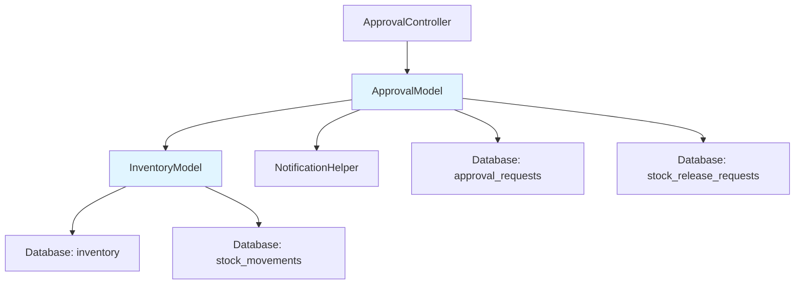
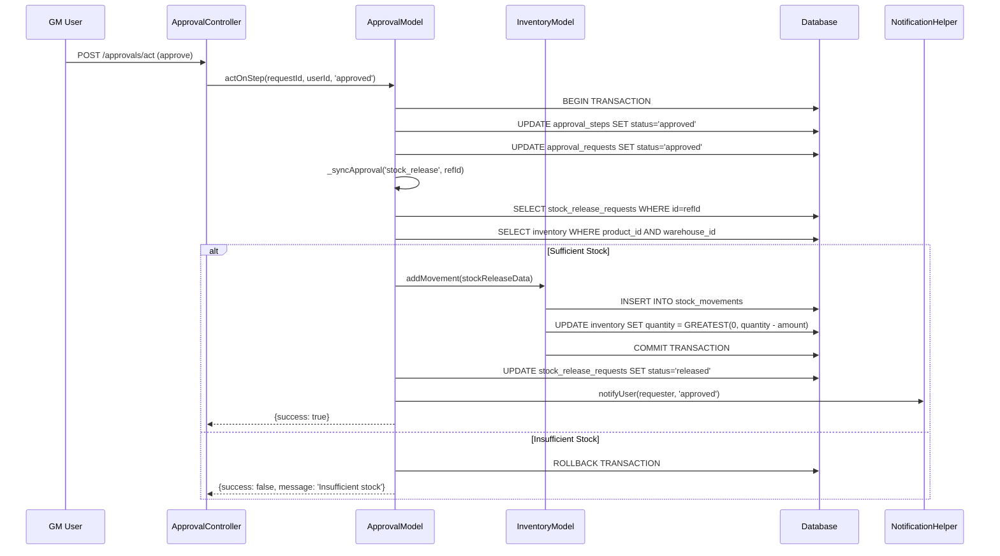

# Design Document: Inventory Stock Reduction on Approval

## Overview

This design specifies the implementation of automatic inventory stock reduction when the General Manager (GM) approves stock release requests. The feature integrates the existing approval workflow system with the inventory management system to ensure that stock quantities are automatically and atomically reduced upon GM approval, maintaining data consistency and providing a complete audit trail.

The implementation extends the existing `ApprovalModel::_syncApproval()` method's stock_release case, which already contains the basic logic. We will enhance it with proper validation, atomic transactions, error handling, and department tracking to meet all requirements.

### Key Design Principles

1. **Atomic Operations**: Stock reduction and approval status updates occur within database transactions
2. **Validation at Approval Time**: Stock availability is verified when GM approves, not just at request creation
3. **Immutable Audit Trail**: All stock movements are recorded and cannot be modified
4. **Department Tracking**: Stock movements include requesting department information for traceability
5. **Idempotency**: Multiple approval attempts do not create duplicate stock movements

## Architecture

### System Components



### Integration Points

1. **ApprovalModel::actOnStep()**: Entry point for GM approval actions
2. **ApprovalModel::_syncApproval()**: Orchestrates stock reduction for approved stock_release requests
3. **InventoryModel::addMovement()**: Creates stock movement and updates inventory atomically
4. **NotificationHelper**: Sends notifications to requesting users

### Data Flow



## Components and Interfaces

### 1. Database Schema Changes

#### Add requesting_department to stock_release_requests

```sql
ALTER TABLE stock_release_requests 
ADD COLUMN requesting_department VARCHAR(50) NULL 
AFTER purpose;
```

This column stores the department identifier (e.g., 'Logistics', 'Production', 'Processing') to track which department is receiving the stock.

### 2. ApprovalModel Enhancements

#### Method: _syncApproval() - Enhanced stock_release case

**Signature**: `private function _syncApproval(string $refType, int $refId, string $status, int $actorId): void`

**Enhanced Logic for stock_release**:

```php
case 'stock_release':
    // Start transaction (already in parent transaction from actOnStep)
    
    // 1. Fetch stock release request
    $req = $this->db->fetchOne(
        "SELECT * FROM stock_release_requests WHERE id=?", 
        [$refId], 'i'
    );
    
    if (!$req) {
        throw new Exception("Stock release request not found: $refId");
    }
    
    // 2. Validate stock availability at approval time
    $currentStock = $this->db->fetchOne(
        "SELECT quantity FROM inventory 
         WHERE product_id=? AND warehouse_id=? FOR UPDATE",
        [$req['product_id'], $req['warehouse_id']], 'ii'
    );
    
    $available = (float)($currentStock['quantity'] ?? 0);
    $requested = (float)$req['quantity'];
    
    if ($available < $requested) {
        $product = $this->db->fetchOne(
            "SELECT name FROM products WHERE id=?", 
            [$req['product_id']], 'i'
        );
        throw new Exception(
            "Insufficient stock for {$product['name']}. " .
            "Requested: $requested, Available: $available"
        );
    }
    
    // 3. Check for existing movement (idempotency)
    $existing = $this->db->fetchOne(
        "SELECT id FROM stock_movements 
         WHERE reference_type='stock_release' AND reference_id=?",
        [$refId], 'i'
    );
    
    if ($existing) {
        // Already processed, skip
        return;
    }
    
    // 4. Create stock movement
    require_once __DIR__ . '/InventoryModel.php';
    $inv = new InventoryModel();
    
    $notes = 'GM approved release: ' . $req['purpose'];
    if (!empty($req['requesting_department'])) {
        $notes .= ' | Dept: ' . $req['requesting_department'];
    }
    
    $inv->addMovement([
        'product_id'     => $req['product_id'],
        'warehouse_id'   => $req['warehouse_id'],
        'type'           => 'out',
        'quantity'       => $requested,
        'reference_type' => 'stock_release',
        'reference_id'   => $refId,
        'notes'          => $notes,
    ]);
    
    // 5. Update stock release request status
    $this->db->query(
        "UPDATE stock_release_requests 
         SET status='released', released_at=NOW() 
         WHERE id=?",
        [$refId], 'i'
    );
    
    break;
```

**Error Handling**: Throws exceptions on validation failures, which will be caught by the parent transaction handler in `actOnStep()`.

### 3. ApprovalModel::actOnStep() Transaction Wrapper

Enhance the existing method to wrap the approval process in a transaction:

```php
public function actOnStep(int $requestId, int $actorId, string $action, string $remarks = ''): array {
    try {
        // Begin transaction
        $this->db->query("START TRANSACTION");
        
        // ... existing validation logic ...
        
        // Update step
        $this->db->query(/* ... */);
        $this->_audit(/* ... */);
        
        if ($action === 'rejected') {
            // ... existing rejection logic ...
            $this->db->query("COMMIT");
            return ['success' => true, 'message' => 'Request rejected.'];
        }
        
        // ... existing next step logic ...
        
        if ($nextStep) {
            // ... forward to next step ...
            $this->db->query("COMMIT");
            return ['success' => true, 'message' => "Approved. Forwarded..."];
        }
        
        // All steps done — fully approved
        $this->db->query(
            "UPDATE approval_requests SET status='approved', updated_at=NOW() WHERE id=?", 
            [$requestId], 'i'
        );
        
        // Sync approval (may throw exception)
        $this->_syncApproval($req['reference_type'], $req['reference_id'], 'approved', $actorId);
        
        // Notify requester
        $this->_notifyRequester($req, 'approved', $remarks);
        
        // Commit transaction
        $this->db->query("COMMIT");
        
        return ['success' => true, 'message' => 'Request fully approved.'];
        
    } catch (Exception $e) {
        // Rollback on any error
        $this->db->query("ROLLBACK");
        
        // Log error
        error_log("Approval transaction failed: " . $e->getMessage());
        
        return [
            'success' => false, 
            'message' => 'Approval failed: ' . $e->getMessage()
        ];
    }
}
```

### 4. InventoryModel Enhancements

The existing `addMovement()` method already handles atomic updates correctly using `ON DUPLICATE KEY UPDATE` with `GREATEST(0, quantity - amount)`. No changes needed, but we document the behavior:

**Method**: `addMovement(array $data): int`

**Atomic Behavior**:
- Inserts stock movement record (immutable audit trail)
- Updates inventory quantity using `GREATEST(0, quantity ± amount)` to prevent negative values
- Uses `ON DUPLICATE KEY UPDATE` for upsert behavior
- Executes within parent transaction when called from approval flow

### 5. Stock Release Request Creation

Enhance the stock release request creation to include department information:

**Location**: InventoryController (new method or enhanced existing)

```php
public function createReleaseRequest(): void {
    $this->requireAuth();
    
    $data = [
        'product_id'             => (int)($_POST['product_id'] ?? 0),
        'warehouse_id'           => (int)($_POST['warehouse_id'] ?? 0),
        'quantity'               => (float)($_POST['quantity'] ?? 0),
        'purpose'                => trim($_POST['purpose'] ?? ''),
        'requesting_department'  => trim($_POST['requesting_department'] ?? ''),
    ];
    
    // Validate inputs
    if (!$data['product_id'] || !$data['warehouse_id'] || $data['quantity'] <= 0) {
        $this->json(['success' => false, 'message' => 'Invalid input.']);
    }
    
    // Validate stock availability at creation time (soft check)
    $stock = $this->db->fetchOne(
        "SELECT i.quantity, p.name 
         FROM inventory i 
         JOIN products p ON i.product_id = p.id
         WHERE i.product_id=? AND i.warehouse_id=?",
        [$data['product_id'], $data['warehouse_id']], 'ii'
    );
    
    if (!$stock || (float)$stock['quantity'] < $data['quantity']) {
        $available = $stock ? $stock['quantity'] : 0;
        $this->json([
            'success' => false, 
            'message' => "Insufficient stock. Available: $available, Requested: {$data['quantity']}"
        ]);
    }
    
    // Create stock release request
    $reqId = $this->db->insert(
        "INSERT INTO stock_release_requests 
         (product_id, warehouse_id, quantity, purpose, requesting_department, requested_by, status)
         VALUES (?,?,?,?,?,?,'pending')",
        [
            $data['product_id'], 
            $data['warehouse_id'], 
            $data['quantity'],
            $data['purpose'],
            $data['requesting_department'],
            $_SESSION['user_id']
        ],
        'iidssi'
    );
    
    // Create approval request
    require_once __DIR__ . '/../models/ApprovalModel.php';
    $approvalModel = new ApprovalModel();
    
    $product = $this->db->fetchOne(
        "SELECT name FROM products WHERE id=?", 
        [$data['product_id']], 'i'
    );
    
    $approvalModel->createRequest([
        'module'         => 'stock_release',
        'reference_type' => 'stock_release',
        'reference_id'   => $reqId,
        'title'          => "Stock Release: {$product['name']} ({$data['quantity']} units)",
        'description'    => $data['purpose'],
    ], $_SESSION['user_id']);
    
    $this->json(['success' => true, 'message' => 'Release request submitted for approval.']);
}
```

## Data Models

### stock_release_requests Table

| Column | Type | Description |
|--------|------|-------------|
| id | INT | Primary key |
| product_id | INT | Foreign key to products |
| warehouse_id | INT | Foreign key to warehouses |
| quantity | DECIMAL(12,2) | Amount to release |
| purpose | VARCHAR(255) | Reason for release |
| requesting_department | VARCHAR(50) | Department receiving stock (NEW) |
| requested_by | INT | Foreign key to users |
| status | ENUM | 'pending', 'approved', 'rejected', 'released' |
| released_at | TIMESTAMP | When GM approved and stock was released |
| notes | TEXT | Additional notes |
| created_at | TIMESTAMP | Request creation time |

### stock_movements Table (existing)

| Column | Type | Description |
|--------|------|-------------|
| id | INT | Primary key |
| product_id | INT | Foreign key to products |
| warehouse_id | INT | Foreign key to warehouses |
| type | ENUM | 'in', 'out', 'return', 'adjustment' |
| quantity | DECIMAL(12,2) | Amount moved |
| reference_type | VARCHAR(50) | Source type (e.g., 'stock_release') |
| reference_id | INT | Source record ID |
| notes | TEXT | Includes department info |
| created_by | INT | Foreign key to users |
| created_at | TIMESTAMP | Movement timestamp (immutable) |

### inventory Table (existing)

| Column | Type | Description |
|--------|------|-------------|
| id | INT | Primary key |
| product_id | INT | Foreign key to products |
| warehouse_id | INT | Foreign key to warehouses |
| quantity | DECIMAL(12,2) | Current stock level |
| updated_at | TIMESTAMP | Last update time |

**Unique Constraint**: (product_id, warehouse_id)


## Correctness Properties

*A property is a characteristic or behavior that should hold true across all valid executions of a system—essentially, a formal statement about what the system should do. Properties serve as the bridge between human-readable specifications and machine-verifiable correctness guarantees.*

### Property 1: Stock Release Request Data Persistence

*For any* stock release request created with product, warehouse, quantity, requesting department, and purpose, querying the database should return a record containing all these fields with matching values.

**Validates: Requirements 1.1**

### Property 2: Stock Availability Validation at Creation

*For any* product and warehouse combination, when creating a stock release request with quantity Q, the request should be accepted if and only if the available stock is >= Q.

**Validates: Requirements 1.2**

### Property 3: Approval Request Creation on Stock Release

*For any* stock release request created, an approval request with status='pending', reference_type='stock_release', and matching reference_id should exist in the approval_requests table.

**Validates: Requirements 1.3**

### Property 4: Department Information Preservation

*For any* stock release request created with a requesting_department value, that department information should be preserved in: (1) the stock_release_requests table, (2) the notes field of any resulting stock_movements record, and (3) query results for stock movements.

**Validates: Requirements 1.4, 3.5, 4.3, 5.1, 5.4**

### Property 5: Approval Status Synchronization

*For any* pending stock release request, when the GM approves it, both the approval_requests.status and stock_release_requests.status should be updated to 'approved' and 'released' respectively within the same transaction.

**Validates: Requirements 2.1, 2.2**

### Property 6: Rejection Status Synchronization

*For any* pending stock release request, when the GM rejects it, both the approval_requests.status and stock_release_requests.status should be updated to 'rejected' within the same transaction.

**Validates: Requirements 2.3, 2.4**

### Property 7: Audit Trail for Approval Actions

*For any* approval action (approve or reject) by the GM, the approval_steps table should record the actioned_by user ID and actioned_at timestamp, and an entry should exist in the approval_audit_log.

**Validates: Requirements 2.5**

### Property 8: Stock Reduction Creates Movement and Reduces Quantity

*For any* GM-approved stock release request with quantity Q for product P in warehouse W, a stock_movements record with type='out' and quantity=Q should exist, and the inventory quantity for (P, W) should be reduced by Q (or to zero if insufficient).

**Validates: Requirements 3.1, 3.2**

### Property 9: Non-Negative Inventory Constraint

*For any* stock reduction operation, the resulting inventory.quantity value should always be >= 0, regardless of the reduction amount.

**Validates: Requirements 3.3, 6.2**

### Property 10: Stock Movement Reference Integrity

*For any* stock movement created from a stock release approval, the reference_type should be 'stock_release' and the reference_id should match the stock_release_requests.id.

**Validates: Requirements 3.4, 4.2**

### Property 11: Audit Trail Completeness

*For any* stock movement record, the product_id, warehouse_id, quantity, and created_at fields should all be non-null and valid (referencing existing products and warehouses).

**Validates: Requirements 4.1**

### Property 12: Queryable Link Between Approval and Movement

*For any* approved stock release request with id=R, there should exist a stock_movement record where reference_type='stock_release' AND reference_id=R, creating a queryable link via JOIN operations.

**Validates: Requirements 4.5**

### Property 13: Department Filtering

*For any* department D, querying stock release requests filtered by requesting_department=D should return only requests where requesting_department=D, and no requests for other departments.

**Validates: Requirements 5.2**

### Property 14: Query Data Availability

*For any* stock release request, querying it should return the approval status (from approval_requests) and released_at timestamp, demonstrating that this data is available through the query interface.

**Validates: Requirements 5.3**

### Property 15: Referential Integrity

*For any* stock movement record, the product_id and warehouse_id should reference existing records in the products and inventory tables respectively, maintaining referential integrity.

**Validates: Requirements 6.4**

### Property 16: Approval Notification

*For any* stock release request approved by the GM, a notification record should be created for the requesting user with type indicating approval.

**Validates: Requirements 7.1**

### Property 17: Rejection Notification

*For any* stock release request rejected by the GM with remarks R, a notification record should be created for the requesting user with type indicating rejection and message containing R.

**Validates: Requirements 7.2**

### Property 18: Notification Content Completeness

*For any* approval or rejection notification for a stock release request, the notification message should contain the request title, product name, quantity, and approval status, and the link field should contain a valid URL to the request detail page.

**Validates: Requirements 7.3, 7.4**

### Property 19: Stock Availability Validation at Approval Time

*For any* stock release request with quantity Q for product P in warehouse W, when the GM attempts to approve it, the approval should succeed if and only if the current inventory quantity for (P, W) is >= Q, and if insufficient, an error message should be returned.

**Validates: Requirements 8.1, 8.2**

### Property 20: Real-Time Stock Validation

*For any* stock release request created when stock quantity is S1, if the stock quantity changes to S2 before GM approval, the approval validation should use S2 (not S1) to determine if sufficient stock exists.

**Validates: Requirements 8.3**

### Property 21: Error Message Content

*For any* approval attempt that fails due to insufficient stock for product P with requested quantity Q and available quantity A, the error message should contain the product name P, requested quantity Q, and available quantity A.

**Validates: Requirements 8.4**

### Property 22: Stock Reduction Timing

*For any* stock release request with a multi-step approval chain, stock reduction (creation of stock_movements record and inventory update) should occur only after the GM approval step completes, not at any earlier approval step.

**Validates: Requirements 9.1**

### Property 23: No Stock Reduction on Early Rejection

*For any* stock release request rejected at any approval step before reaching the GM, no stock_movements record with reference to that request should exist, and the inventory quantity should remain unchanged.

**Validates: Requirements 9.2**

### Property 24: Idempotency

*For any* stock release request that has been fully approved, attempting to process the approval again should not create duplicate stock_movements records—exactly one stock_movements record should exist for each approved stock release request.

**Validates: Requirements 9.4**

### Property 25: Rollback on Stock Reduction Failure

*For any* approval attempt where the stock reduction operation fails (e.g., due to insufficient stock discovered during the transaction), the approval_requests.status and approval_steps.status should remain unchanged (not updated to 'approved').

**Validates: Requirements 10.1**

### Property 26: Rollback on Approval Failure

*For any* approval attempt where the approval status update fails after stock movement creation, the stock_movements record should not exist in the database (rolled back), and the inventory quantity should remain unchanged.

**Validates: Requirements 10.2**

## Error Handling

### Validation Errors

**Insufficient Stock at Creation**:
- Error: "Insufficient stock. Available: {available}, Requested: {requested}"
- HTTP Status: 400 Bad Request
- Action: Request rejected, no approval request created

**Insufficient Stock at Approval**:
- Error: "Insufficient stock for {product_name}. Requested: {requested}, Available: {available}"
- HTTP Status: 400 Bad Request (returned as JSON response)
- Action: Approval transaction rolled back, approval status unchanged

**Invalid Input Data**:
- Error: "Invalid input." or specific field validation messages
- HTTP Status: 400 Bad Request
- Action: Request rejected before database operations

### System Errors

**Database Transaction Failure**:
- Error: "Approval failed: {exception_message}"
- Logging: Full exception logged to error_log with context
- Action: Transaction rolled back, user receives error message

**Stock Release Request Not Found**:
- Error: "Stock release request not found: {id}"
- Action: Exception thrown, transaction rolled back

**Missing Product/Warehouse**:
- Error: Foreign key constraint violation
- Action: Transaction rolled back, error logged

### Concurrency Errors

**Race Condition on Stock Update**:
- Mitigation: Use `SELECT ... FOR UPDATE` to lock inventory row during approval
- Behavior: Second concurrent approval waits for first to complete
- Result: Sequential processing ensures consistency

**Duplicate Movement Prevention**:
- Check: Query for existing stock_movements with matching reference before creating
- Behavior: If movement exists, skip creation (idempotency)
- Result: Exactly one movement per approval, even if approval processed multiple times

## Testing Strategy

### Unit Testing

Unit tests will focus on specific examples, edge cases, and integration points:

**Stock Release Request Creation**:
- Valid request with all required fields
- Request with missing required fields (should fail)
- Request with zero or negative quantity (should fail)
- Request exceeding available stock (should fail)
- Request with invalid department name

**GM Approval Processing**:
- Approval of valid request with sufficient stock
- Approval attempt with insufficient stock (should fail and rollback)
- Rejection of request
- Approval of already-approved request (idempotency)

**Stock Movement Creation**:
- Movement record contains all required fields
- Movement notes include department information
- Movement correctly references stock release request

**Notification Delivery**:
- Notification created on approval
- Notification created on rejection
- Notification contains required information

**Error Scenarios**:
- Database connection failure during approval
- Invalid stock release request ID
- Concurrent approval attempts

### Property-Based Testing

Property tests will verify universal properties across all inputs using a PHP property-based testing library (e.g., Eris or php-quickcheck). Each test will run a minimum of 100 iterations with randomized inputs.

**Test Configuration**:
- Library: Eris (https://github.com/giorgiosironi/eris)
- Iterations: 100 minimum per property
- Generators: Random products, warehouses, quantities, departments, user IDs

**Property Test Implementation**:

Each correctness property listed above will be implemented as a property-based test with the following tag format in comments:

```php
/**
 * Feature: inventory-stock-reduction-on-approval
 * Property 1: Stock Release Request Data Persistence
 * 
 * For any stock release request created with product, warehouse, quantity,
 * requesting department, and purpose, querying the database should return
 * a record containing all these fields with matching values.
 */
public function testStockReleaseRequestDataPersistence() {
    $this->forAll(
        Generator\int(1, 100),      // product_id
        Generator\int(1, 10),       // warehouse_id
        Generator\float(1, 1000),   // quantity
        Generator\elements(['Logistics', 'Production', 'Processing']), // department
        Generator\string()          // purpose
    )->then(function($productId, $warehouseId, $quantity, $dept, $purpose) {
        // Setup: Ensure product and warehouse exist, set stock level
        // Action: Create stock release request
        // Assert: Query database and verify all fields match
    });
}
```

**Key Property Tests**:

1. **Data Persistence Properties** (Properties 1, 4, 11): Generate random valid inputs, create records, verify all fields persisted correctly

2. **Validation Properties** (Properties 2, 19, 20): Generate random stock levels and request quantities, verify validation logic accepts/rejects correctly

3. **State Transition Properties** (Properties 5, 6, 8): Generate random requests, perform approval/rejection, verify state changes are correct and atomic

4. **Invariant Properties** (Properties 9, 15): Generate random operations, verify constraints always hold (non-negative stock, referential integrity)

5. **Audit Trail Properties** (Properties 7, 10, 12): Generate random approvals, verify complete audit trail exists with correct references

6. **Query Properties** (Properties 13, 14): Generate random data sets, verify queries return correct filtered results

7. **Notification Properties** (Properties 16, 17, 18): Generate random approvals/rejections, verify notifications created with correct content

8. **Timing Properties** (Properties 22, 23): Generate multi-step approval chains, verify stock reduction occurs at correct step only

9. **Idempotency Properties** (Property 24): Generate random approvals, process multiple times, verify exactly one movement created

10. **Rollback Properties** (Properties 25, 26): Generate failure scenarios, verify transactions rolled back correctly

**Test Data Generators**:

```php
// Generate valid stock release request data
function generateStockReleaseRequest() {
    return [
        'product_id' => Generator\int(1, 100),
        'warehouse_id' => Generator\int(1, 10),
        'quantity' => Generator\float(0.01, 1000),
        'purpose' => Generator\string(),
        'requesting_department' => Generator\elements([
            'Logistics', 'Production', 'Processing'
        ])
    ];
}

// Generate stock levels that may or may not be sufficient
function generateStockScenario() {
    return Generator\tuple(
        Generator\float(0, 1000),    // current stock
        Generator\float(0.01, 1000)  // requested quantity
    );
}
```

**Edge Cases to Cover**:

- Zero stock available
- Exact stock match (available == requested)
- Very large quantities
- Empty strings for text fields
- Concurrent approvals (requires special test setup)
- Missing foreign key references
- Null values in optional fields

### Integration Testing

Integration tests will verify the complete flow across controllers, models, and database:

**End-to-End Approval Flow**:
1. Create stock release request via InventoryController
2. Verify approval request created
3. Approve via ApprovalController as GM
4. Verify stock reduced, movement created, notification sent
5. Query stock movements and verify department information

**Multi-Department Scenarios**:
1. Create requests for different departments
2. Approve all requests
3. Query by department and verify filtering works

**Failure and Rollback Scenarios**:
1. Create request with sufficient stock
2. Reduce stock externally to create insufficient condition
3. Attempt approval and verify rollback
4. Verify no movement created and approval status unchanged

### Test Database Setup

All tests will use a test database with:
- Sample products and warehouses
- Sample users with different roles (GM, inventory_user, etc.)
- Approval chains configured for stock_release module
- Clean state before each test (transactions or database reset)

### Continuous Integration

- All tests run on every commit
- Property tests run with 100 iterations in CI
- Integration tests run against MySQL test database
- Code coverage target: >80% for new code
- Failed property tests should output the failing example for debugging
